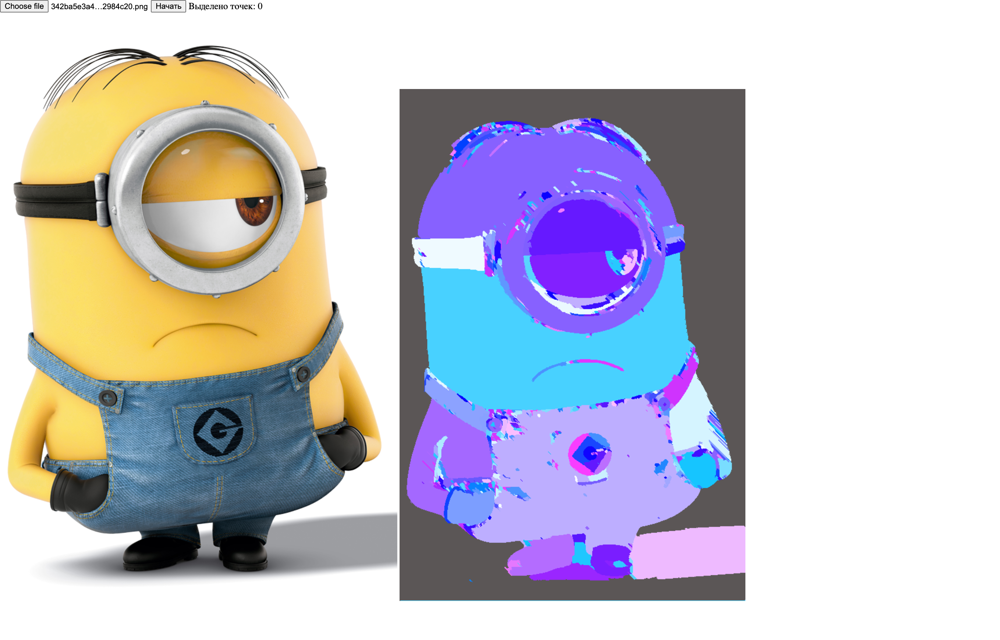
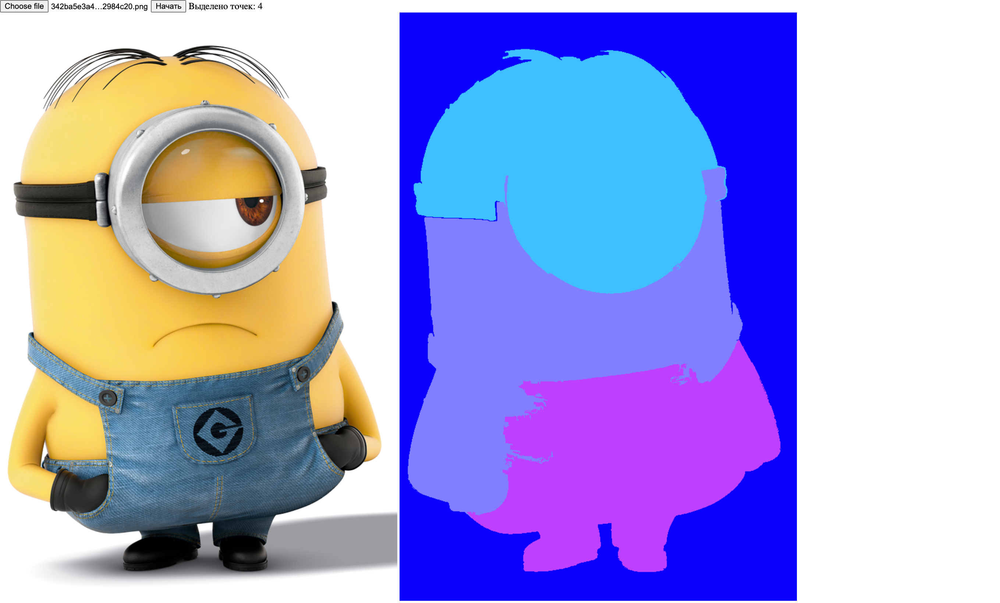

# Watershed

Добрались руки до реализации алгоритма сегментации изображения методом водораздела. Реализованы версия и с маркерами и без.

Задача висела со второго курса университета, интерес был получить удовлетворительный результат работы алгоритма.

У меня не было цели получить оптимальный/очень качественный результат. Цель - закрыть задачу, которая всплывала в памяти последние 7 лет и благополучно забыть о ней.

Инструменты реализации (html/js) выбраны просто потому что были под рукой.

## Описание

Для запуска нужно выбрать изображение.

Чтобы запустить алгоритм без маркеров нужно нажать "Начать"

Чтобы указать маркеры, нужно просто нажать на соответствующие точки изображения. После выбора всех маркеров, нажать "Начать"

По алгоритму с маркерами имеет смысл выполнить оптимизации, но учитывая цель реализации я решил остановиться на текущем результате
## Примеры
### Без маркеров

### Маркеры

## Литература
[Алгоритм](https://habr.com/ru/company/intel/blog/266347/)

[Описание улучшения](https://masters.donntu.org/2010/fknt/tsibulka/library/article2_r.htm)

[Морфология](https://ru.wikipedia.org/wiki/%D0%9C%D0%B0%D1%82%D0%B5%D0%BC%D0%B0%D1%82%D0%B8%D1%87%D0%B5%D1%81%D0%BA%D0%B0%D1%8F_%D0%BC%D0%BE%D1%80%D1%84%D0%BE%D0%BB%D0%BE%D0%B3%D0%B8%D1%8F)

[Deep Watershed Transform](https://habr.com/ru/post/354040/) - интересное развитие идеи
